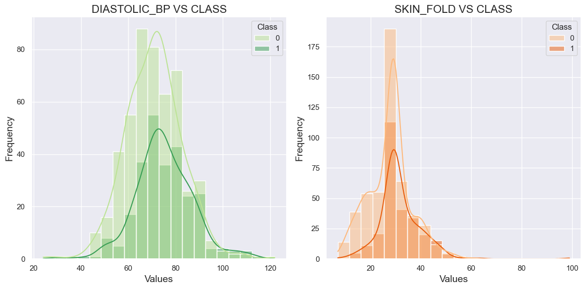
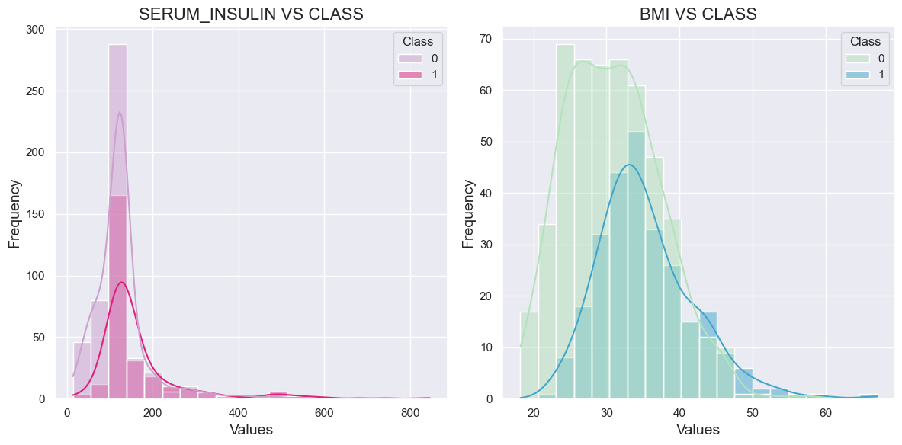
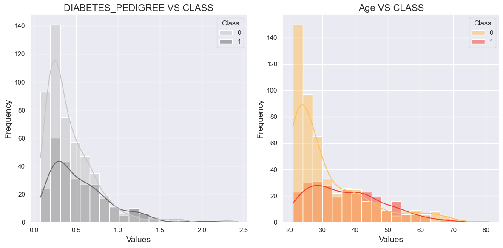

# Diabetes Dataset Analysis

This project focuses on analyzing the `diabetes.csv` dataset to understand factors contributing to diabetes and to build predictive models for diagnosing diabetes based on various medical and lifestyle factors. The dataset contains health-related attributes collected from patients and is used to perform exploratory data analysis (EDA) and machine learning model development.

## Dataset Overview

The `diabetes.csv` dataset consists of several health-related features of patients, which can be used to predict whether a patient has diabetes or not. The dataset includes the following columns:

- **Pregnancies:** Number of times the patient has been pregnant.
- **Glucose:** Plasma glucose concentration.
- **BloodPressure:** Diastolic blood pressure (mm Hg).
- **SkinThickness:** Triceps skinfold thickness (mm).
- **Insulin:** 2-Hour serum insulin (mu U/ml).
- **BMI:** Body mass index (weight in kg/(height in m)^2).
- **DiabetesPedigreeFunction:** A function that represents the likelihood of diabetes based on family history.
- **Age:** Age of the patient in years.
- **Outcome:** The target variable (0 or 1), where 1 indicates diabetes and 0 indicates no diabetes.

## Analysis 1

  

INFERENCES FROM THE HISTOGRAMS

  
  <!-- First Column -->
  

    <ol style="margin:0 left; text-align:left;">
      <li>PREGNANCY VS CLASS 
       
        <ul>
          <li style="font-size:20px">Most of the individuals in the dataset have 0 pregnancies, especially in the "Class 0" group (non-diabetic).</li>
          <li style="font-size:20px">For the "Class 1" group (Diabetic class), individuals with higher numbers of pregnancies (between 5-10) seem more frequent compared to "Class 0."</li>
          <li style="font-size:20px">This suggests that a higher number of pregnancies might be associated with a greater likelihood of belonging to "Class 1" (perhaps indicating a higher risk factor).</li>
          </ul>
      </li>
    </ol>
  

  
  <!-- Second Column -->
  

    <ol start="2">
      <li>GLUCOSE VS CLASS 
       
        <ul>
          <li style="font-size:20px">The "Class 0" group has a large concentration of individuals in their 20s and early 30s, indicating that younger individuals are more frequent in this group.</li>
          <li style="font-size:20px">The "Class 1" group also has individuals concentrated in younger age brackets but shows slightly more spread across older ages, particularly between the ages of 30-50.</li>
          <li style="font-size:20px">This suggests that older age may be correlated with a higher likelihood of being in "Class 1," which could point toward age as a risk factor.</li>
        </ul>
      </li>
    </ol>
  

## Analysis 2

  

INFERENCES FROM THE HISTOGRAMS

  
  <!-- First Column -->
  

    <ol style="margin:0 left; text-align:left;">
      <li>DIASTOLIC_BP VS CLASS 
       
        <ul>
          <li style="font-size:20px">Class 0 (Non-diabetic) shows a roughly normal distribution with a peak between 70-80 mmHg.</li>
          <li style="font-size:20px">Class 1 (Diabetic) has a lower overall frequency and also peaks between 70-80 mmHg but shows a slight skew compared to Class 0.</li>
          <li style="font-size:20px">As the data is evenly spread across the values it may not be an crucial factor in deciding whether the person is diabetic or not.</li>
          </ul>
      </li>
    </ol>
  

  
  <!-- Second Column -->
  

    <ol start="2">
      <li>SKINFOLD VS CLASS 
       
        <ul>
          <li style="font-size:20px">Class 0 shows a sharp peak around 20-30 mm and declines steadily, indicating most non-diabetics have lower skinfold thickness.</li>
          <li style="font-size:20px">Class 1 shows a broader peak around 30-40 mm, suggesting that individuals with diabetes may have slightly higher skin fold thickness on average.</li>
          <li style="font-size:20px">Higher skin fold thickness could be indicative of diabetes, with more variation in the diabetic group.</li>
        </ul>
      </li>
    </ol>
  

## Analysis 3

  

INFERENCES FROM THE HISTOGRAMS

  
  <!-- First Column -->
  

    <ol style="margin:0 left; text-align:left;">
      <li>SERUM_INSULIN VS CLASS 
       
        <ul>
          <li style="font-size:20px">Class 0 has a sharp peak around 100-150 µU/mL, indicating lower serum insulin levels are more common in non-diabetics.</li>
          <li style="font-size:20px">Class 1 shows more individuals with higher serum insulin levels (200-300 µU/mL), with a wider distribution overall.</li>
          <li style="font-size:20px"> Elevated serum insulin levels seem to correlate with the diabetic class, likely due to insulin resistance.</li>
          </ul>
      </li>
    </ol>
  

  
  <!-- Second Column -->
  

    <ol start="2">
      <li>BMI VS CLASS 
       
        <ul>
          <li style="font-size:20px">Class 0 tends to have a peak around 25-30, which is in the overweight range, but the distribution is narrower.</li>
          <li style="font-size:20px">Class 1 shows a wider spread with a peak at a higher BMI (30-35), indicating a higher prevalence of obesity among diabetics.</li>
          <li style="font-size:20px">Higher BMI is strongly associated with Class 1 (diabetics), showing that obesity may be a risk factor for diabetes.</li>
        </ul>
      </li>
    </ol>
  

## Analysis 4

  

INFERENCES FROM THE HISTOGRAMS

  
  <!-- First Column -->
  

    <ol style="margin:0 left; text-align:left;">
      <li>DIABETES_PEDIGREE VS CLASS 
       
        <ul>
          <li style="font-size:20px">Class 0 has a sharp drop-off as the pedigree score increases, with most individuals clustering around low values (below 0.5).</li>
          <li style="font-size:20px">Class 1 shows a flatter distribution, with more individuals having higher pedigree scores (above 0.5).</li>
          <li style="font-size:20px">Higher diabetes pedigree scores correlate more with individuals in Class 1, reflecting a potential genetic predisposition to diabetes.</li>
          </ul>
      </li>
    </ol>
  

  
  <!-- Second Column -->
  

    <ol start="2">
      <li>AGE VS CLASS 
       
        <ul>
          <li style="font-size:20px">Class 0 is concentrated around the younger age range (20-30 years), while Class 1 has a more evenly distributed frequency, with a secondary peak around 50 years.</li>
          <li style="font-size:20px">Older age appears to be more associated with diabetes, as evidenced by the higher frequency of older individuals in Class 1.</li>
          </ul>
        </ul>
      </li>
    </ol>
  

