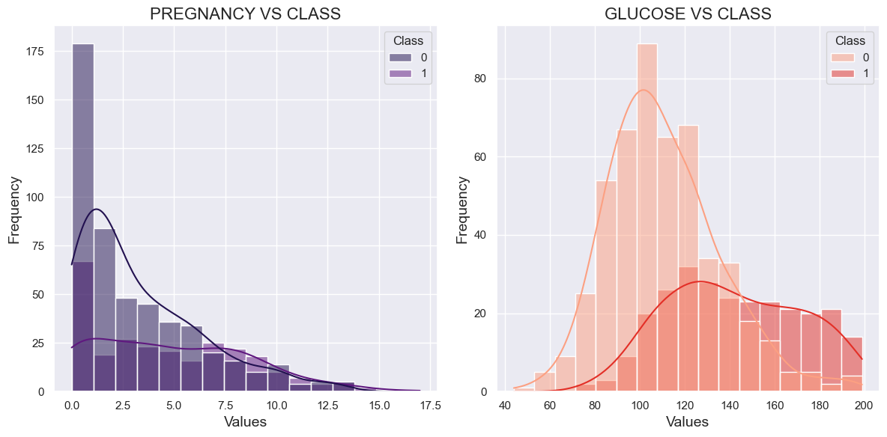

# Analysis Dashboard

This dashboard provides insights into air pollution analysis, with a focus on pollutants in Delhi. It contains three main analyses: Time Series Analysis, Pollutant Concentration, and a Heatmap of Pollutants. Each analysis is displayed based on the selected option, and the results help in understanding the behavior of different air pollutants.

  

INFERENCES FROM THE HISTOGRAMS

  
  <!-- First Column -->
  

    <ol style="margin:0 left; text-align:left;">
      <li>PREGNANCY VS CLASS 
       
        <ul>
          <li style="font-size:20px">Most of the individuals in the dataset have 0 pregnancies, especially in the "Class 0" group (non-diabetic).</li>
          <li style="font-size:20px">For the "Class 1" group (Diabetic class), individuals with higher numbers of pregnancies (between 5-10) seem more frequent compared to "Class 0."</li>
          <li style="font-size:20px">This suggests that a higher number of pregnancies might be associated with a greater likelihood of belonging to "Class 1" (perhaps indicating a higher risk factor).</li>
          </ul>
      </li>
    </ol>
  

  
  <!-- Second Column -->
  

    <ol start="2">
      <li>GLUCOSE VS CLASS 
       
        <ul>
          <li style="font-size:20px">The "Class 0" group has a large concentration of individuals in their 20s and early 30s, indicating that younger individuals are more frequent in this group.</li>
          <li style="font-size:20px">The "Class 1" group also has individuals concentrated in younger age brackets but shows slightly more spread across older ages, particularly between the ages of 30-50.</li>
          <li style="font-size:20px">This suggests that older age may be correlated with a higher likelihood of being in "Class 1," which could point toward age as a risk factor.</li>
        </ul>
      </li>
    </ol>
  

